# Modeling and prediction for movies
Dale Richardson  
`r format(Sys.Date(), "%B %d, %Y")`  

## Setup

### Load packages


```r
library(ggplot2)
```

```
## Warning: package 'ggplot2' was built under R version 3.3.2
```

```r
library(dplyr)
library(statsr)
library(GGally) #for the ggpairs function
```

```
## Warning: package 'GGally' was built under R version 3.3.2
```

### Load data


```r
load("movies.Rdata")
```

* * *

## Part 1: Data

We have been provided a dataset of 651 **randomly sampled** movies produced and released prior to 2016. 
This dataset contains 32 variables, some of which will not be useful for statistical modeling (i.e. `imdb_url`). We have not been provided any further details as to how the movies were exactly randomly selected, so there may be some unknown bias present in the dataset (unlikely, but possible). We will assume that our findings based on this dataset will be generalizable to the population of movies produced and released prior to 2016 in the United States.

While the movies in this dataset have been selected randomly, it is **not possible to infer causality**. No random assignment into experimental/control groups was conducted regarding these movies. Therefore, we are unable to infer causality and instead can only highlight associations between variables.

* * *

## Part 2: Research question

As we have been "contracted" as Data Scientists for Paramount Pictures and given the task to decipher what elements 
contribute to movie popularity, the research question I propose is the following:

#### What factors are associated with movie popularity and can we use these factors to predict if a movie is popular?

One of the first things we will need to define is what exactly "popularity" is. How can we establish if a movie is popular and once we have this definition, which factors contribute most to a movie's popularity?

For the sake of this project, I will use a movie's [IMDB](http://www.imdb.com) rating (`imdb_rating`) as a proxy for its popularity and success. Thefore, the higher the movie's IMDB rating, the more popular and successful it is. This is certainly a gross oversimiplification, but for the purposes of this project, it will serve nicely. We will entertain the idea that movie popularity and success extend well beyond the time the movie is shown in the theater. 

The above research question is of interest as understanding the characteristics that lead to a movie's popularity and success can assist studios and production teams on how to make more informed decisions during the movie-making process. For example, which movie genres tend to be the most popular? What is the best time of year to release a movie to ensure a higher level of box office success? How do sites like Rotten Tomatoes and IMDB affect DVD sales and rentals? The list of questions goes on and well beyond the scope of this project and involves tools and techniques we have not yet learned.

* * *

## Part 3: Exploratory data analysis
Prior to exploring the data, I will first remove unnecessary variables from the dataframe, such as the `actor1-5` 
variables and the `url` variables. The `actor` variables denote the main actors/actresses in the adbridged cast of the movie, while the `url` variables indicate the Rotten Tomatoes or IMDB links for the movies. It is unlikely that either of these variables will be useful in the linear model.

### Data cleaning

```r
# drop useless variables
movies.clean <- movies %>% select(-starts_with("actor"), -contains("url") )

# check that all is ok
str(movies.clean)
```

```
## Classes 'tbl_df', 'tbl' and 'data.frame':	651 obs. of  25 variables:
##  $ title           : chr  "Filly Brown" "The Dish" "Waiting for Guffman" "The Age of Innocence" ...
##  $ title_type      : Factor w/ 3 levels "Documentary",..: 2 2 2 2 2 1 2 2 1 2 ...
##  $ genre           : Factor w/ 11 levels "Action & Adventure",..: 6 6 4 6 7 5 6 6 5 6 ...
##  $ runtime         : num  80 101 84 139 90 78 142 93 88 119 ...
##  $ mpaa_rating     : Factor w/ 6 levels "G","NC-17","PG",..: 5 4 5 3 5 6 4 5 6 6 ...
##  $ studio          : Factor w/ 211 levels "20th Century Fox",..: 91 202 167 34 13 163 147 118 88 84 ...
##  $ thtr_rel_year   : num  2013 2001 1996 1993 2004 ...
##  $ thtr_rel_month  : num  4 3 8 10 9 1 1 11 9 3 ...
##  $ thtr_rel_day    : num  19 14 21 1 10 15 1 8 7 2 ...
##  $ dvd_rel_year    : num  2013 2001 2001 2001 2005 ...
##  $ dvd_rel_month   : num  7 8 8 11 4 4 2 3 1 8 ...
##  $ dvd_rel_day     : num  30 28 21 6 19 20 18 2 21 14 ...
##  $ imdb_rating     : num  5.5 7.3 7.6 7.2 5.1 7.8 7.2 5.5 7.5 6.6 ...
##  $ imdb_num_votes  : int  899 12285 22381 35096 2386 333 5016 2272 880 12496 ...
##  $ critics_rating  : Factor w/ 3 levels "Certified Fresh",..: 3 1 1 1 3 2 3 3 2 1 ...
##  $ critics_score   : num  45 96 91 80 33 91 57 17 90 83 ...
##  $ audience_rating : Factor w/ 2 levels "Spilled","Upright": 2 2 2 2 1 2 2 1 2 2 ...
##  $ audience_score  : num  73 81 91 76 27 86 76 47 89 66 ...
##  $ best_pic_nom    : Factor w/ 2 levels "no","yes": 1 1 1 1 1 1 1 1 1 1 ...
##  $ best_pic_win    : Factor w/ 2 levels "no","yes": 1 1 1 1 1 1 1 1 1 1 ...
##  $ best_actor_win  : Factor w/ 2 levels "no","yes": 1 1 1 2 1 1 1 2 1 1 ...
##  $ best_actress_win: Factor w/ 2 levels "no","yes": 1 1 1 1 1 1 1 1 1 1 ...
##  $ best_dir_win    : Factor w/ 2 levels "no","yes": 1 1 1 2 1 1 1 1 1 1 ...
##  $ top200_box      : Factor w/ 2 levels "no","yes": 1 1 1 1 1 1 1 1 1 1 ...
##  $ director        : chr  "Michael D. Olmos" "Rob Sitch" "Christopher Guest" "Martin Scorsese" ...
```

```r
# which columns contain missing values, i.e. NA?
colSums(is.na(movies.clean))
```

```
##            title       title_type            genre          runtime 
##                0                0                0                1 
##      mpaa_rating           studio    thtr_rel_year   thtr_rel_month 
##                0                8                0                0 
##     thtr_rel_day     dvd_rel_year    dvd_rel_month      dvd_rel_day 
##                0                8                8                8 
##      imdb_rating   imdb_num_votes   critics_rating    critics_score 
##                0                0                0                0 
##  audience_rating   audience_score     best_pic_nom     best_pic_win 
##                0                0                0                0 
##   best_actor_win best_actress_win     best_dir_win       top200_box 
##                0                0                0                0 
##         director 
##                2
```

```r
# show only those having NAs
colnames(movies.clean)[colSums(is.na(movies.clean)) > 0]
```

```
## [1] "runtime"       "studio"        "dvd_rel_year"  "dvd_rel_month"
## [5] "dvd_rel_day"   "director"
```

Looks like we are missing 1 `runtime`, 8 `studio` and 8 `dvd_rel_year`, `dvd_rel_month` and `dvd_rel_day` and 2 `director`
observations. In principle, we could probably fill these data in by searching google but for the purposes of this assignment,
I will leave them as NAs. However, I will check which runtime is missing and see if I can insert it as I will probably use
this variable in my linear model.


```r
# which movie is missing the runtime?
movies.clean[which(is.na(movies$runtime)),]
```

```
## # A tibble: 1 × 25
##                title  title_type       genre runtime mpaa_rating  studio
##                <chr>      <fctr>      <fctr>   <dbl>      <fctr>  <fctr>
## 1 The End of America Documentary Documentary      NA     Unrated Indipix
## # ... with 19 more variables: thtr_rel_year <dbl>, thtr_rel_month <dbl>,
## #   thtr_rel_day <dbl>, dvd_rel_year <dbl>, dvd_rel_month <dbl>,
## #   dvd_rel_day <dbl>, imdb_rating <dbl>, imdb_num_votes <int>,
## #   critics_rating <fctr>, critics_score <dbl>, audience_rating <fctr>,
## #   audience_score <dbl>, best_pic_nom <fctr>, best_pic_win <fctr>,
## #   best_actor_win <fctr>, best_actress_win <fctr>, best_dir_win <fctr>,
## #   top200_box <fctr>, director <chr>
```

```r
# checking google for "The End of America Documentary", we find that the running time is 71 minutes. I will add this value as I may use this variable in my linear model
movies.clean$runtime[334] <- 71

# check that all ok
movies.clean[334,]
```

```
## # A tibble: 1 × 25
##                title  title_type       genre runtime mpaa_rating  studio
##                <chr>      <fctr>      <fctr>   <dbl>      <fctr>  <fctr>
## 1 The End of America Documentary Documentary      71     Unrated Indipix
## # ... with 19 more variables: thtr_rel_year <dbl>, thtr_rel_month <dbl>,
## #   thtr_rel_day <dbl>, dvd_rel_year <dbl>, dvd_rel_month <dbl>,
## #   dvd_rel_day <dbl>, imdb_rating <dbl>, imdb_num_votes <int>,
## #   critics_rating <fctr>, critics_score <dbl>, audience_rating <fctr>,
## #   audience_score <dbl>, best_pic_nom <fctr>, best_pic_win <fctr>,
## #   best_actor_win <fctr>, best_actress_win <fctr>, best_dir_win <fctr>,
## #   top200_box <fctr>, director <chr>
```

From the output above, we can see that the runtime for "The End of America Documentary" has been correctly inserted. Next, I will explore the data and see which variables I will use for linear modeling to predict movie popularity/success. 

### Exploratory plots

I will quickly begin by looking at the relationship between `critic_score` and `audience_score`, which I suspect will be highly correlated. I'll also look at the relationship between `critic_score` and `imdb_rating`. I also suspect these two will be highly correlated. In the end, I will combine the `critics_score` and `audience_score` into a single variable for use in my linear model to predict `imdb_rating`. 


```r
# look at relationship between critic score and audience score
ggplot(movies.clean, aes(critics_score, audience_score)) + geom_jitter() + 
        geom_smooth(method = "lm") + ggtitle("Critics and Audience scores are strongly positively correlated")
```

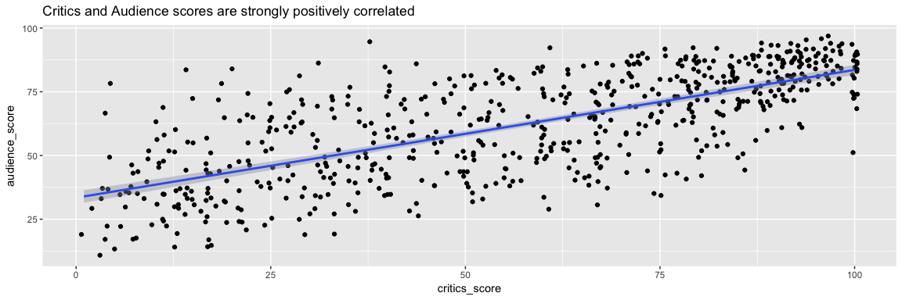<!-- -->

```r
# look at relationship between critic score and imdb rating
ggplot(movies.clean, aes(critics_score, imdb_rating)) + geom_jitter() + 
        geom_smooth(method = "lm") + ggtitle("Critics score and IMDB rating are strongly positively correlated")
```

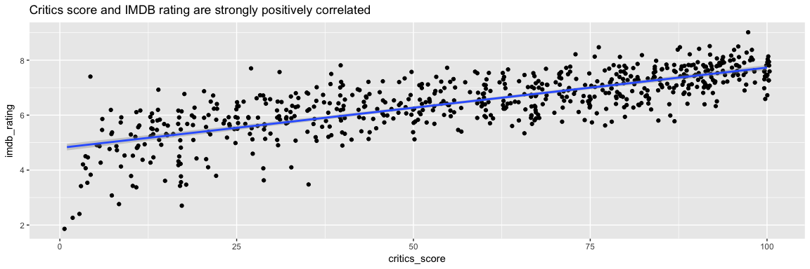<!-- -->

```r
# calculate correlation between critics_score and audience_score
cor(movies.clean$critics_score, movies.clean$audience_score)
```

```
## [1] 0.7042762
```

```r
# calculate correlation between critics_score and imdb_rating
cor(movies.clean$critics_score, movies.clean$imdb_rating)
```

```
## [1] 0.7650355
```

The above plots reveal strong, positive linear relationships between the variables as evidenced by the high correlation coefficients. However, let us now use the [GGally](http://ggobi.github.io/ggally/#ggally) package to create a pairwise correlation matrix of some potentially useful numerical variables in the `movies.clean` dataframe, rather than create plots one by one for each numerical variable of interest.

### Correlation matrix of numerical variables
An easy way to get an overiew of the data is to use the `ggpairs()` function from the `GGally` package. I will use this function
to create a correlation matrix of the numerical variables in the `movies.clean` dataframe. These variables are the following:

1. `runtime`
2. `imdb_rating`
3. `imdb_num_votes`
4. `critics_score`
5. `audience_score`


```r
# plot only the numerical variables of interest from the dataframe
ggpairs(movies.clean, columns = c(4,13,14,16,18 ))
```

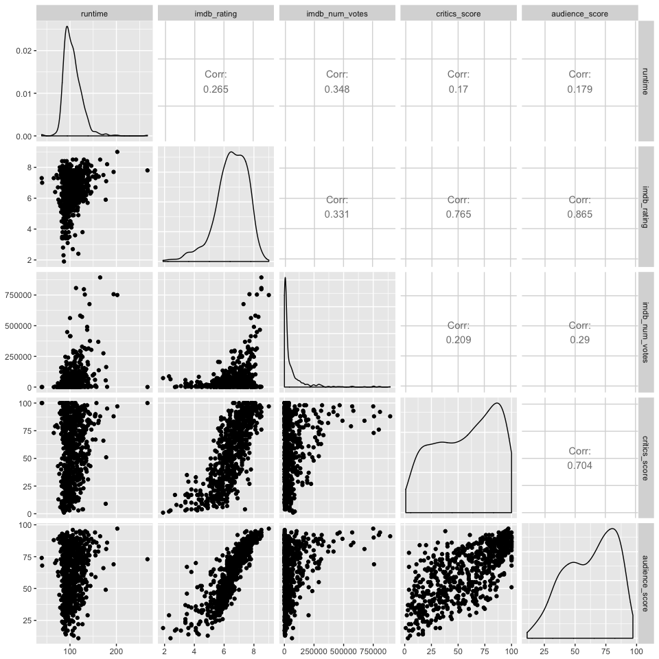<!-- -->

##### Some variables are collinear
The above correlation matrix reveals several collinear numerical variables, namely `critics_score`, `audience_score`,
and `imdb_rating`. Therefore, I will calculate the mean of `critics_score` and `audience_score` and store this value in a new variable, `combined_score`. We will use `imdb_rating` as the proxy for movie popularity and try to predict the IMDB rating of a movie. The other numeric variables have low correlations, between `0.181` and `0.347`, so it is unlikely that they will substantially confound the linear model.

### Creating a new variable, `combined_score`

Here I create a `combined_score` variable that is the mean of the `critics_score` and `audience_score`. I foresee that this variable will be a strong predictor of the IMDB rating. 


```r
# create the combined_score variable as the arithmetic mean of critics_score and audience_score
movies.clean$combined_score <- (movies.clean$critics_score + movies.clean$audience_score) / 2

# what does the 5-number summary look like?
summary(movies.clean$combined_score)
```

```
##    Min. 1st Qu.  Median    Mean 3rd Qu.    Max. 
##    7.00   42.75   61.00   60.03   79.75   97.00
```

We can see from the 5-number summary the distribution of `combined_score`. For fun, let's see what the lowest-rated and highest rated movies are.


```r
worst <- movies.clean[which.min(movies.clean$combined_score),1]
best <- movies.clean[which.max(movies.clean$combined_score),1]

# The worst movie is:
worst
```

```
## # A tibble: 1 × 1
##               title
##               <chr>
## 1 Battlefield Earth
```

```r
# The best movie is:
best
```

```
## # A tibble: 1 × 1
##                    title
##                    <chr>
## 1 The Godfather, Part II
```

It does not surprise me at all that *Battlefield Earth* is the lowest rated movie in this dataset and probably would be amongst
an even larger sample of movies!! The converse could be said of *The Godfather, Part II*, which is a classic.

* * *

## Part 4: Modeling

I will establish a linear model to predict the `imdb_rating` of a movie not included in the sample of movies.

The variables I will use for my full model are the following:

1. `genre`
2. `runtime`
3. `mpaa_rating` 
4. `imdb_num_votes`
5. `critics_rating`
6. `combined_score`
7. `top200_box`
8. `best_pic_nom`
9. `best_pic_win`
10. `best_actor_win`
11. `best_dir_win`

I will exclude the `audience_rating` variable as it may be redundant or in conflict with `critics_rating`. Furthermore, I will also exclude the variables related to DVD and theatrical release dates, e.g. `dvd_rel_year`, `dvd_rel_month`, `dvd_rel_day` to simplify things as there are missing data in these variables that I chose not to impute/rectify. The same can be said for `director`, which I have also chosen to exclude as it is highly likely that the `director` variable contains too many unique entries which would make it useless as a factor. In fact, there are 533 unique directors, which would be way too many levels!

### Fit the model

```r
first <- lm(imdb_rating ~ genre + runtime + mpaa_rating + imdb_num_votes + critics_rating  +
                    combined_score + top200_box + best_pic_nom + best_pic_win + best_actor_win + best_dir_win, 
            data = movies.clean)

# summarise the model
summary(first)
```

```
## 
## Call:
## lm(formula = imdb_rating ~ genre + runtime + mpaa_rating + imdb_num_votes + 
##     critics_rating + combined_score + top200_box + best_pic_nom + 
##     best_pic_win + best_actor_win + best_dir_win, data = movies.clean)
## 
## Residuals:
##     Min      1Q  Median      3Q     Max 
## -2.3314 -0.2154  0.0435  0.2765  1.3457 
## 
## Coefficients:
##                                  Estimate Std. Error t value Pr(>|t|)    
## (Intercept)                     2.746e+00  2.098e-01  13.090  < 2e-16 ***
## genreAnimation                 -3.355e-01  1.849e-01  -1.814 0.070148 .  
## genreArt House & International  3.816e-01  1.432e-01   2.664 0.007915 ** 
## genreComedy                    -1.127e-01  7.884e-02  -1.430 0.153230    
## genreDocumentary                4.151e-01  1.093e-01   3.797 0.000161 ***
## genreDrama                      9.101e-02  6.933e-02   1.313 0.189770    
## genreHorror                     2.154e-02  1.177e-01   0.183 0.854867    
## genreMusical & Performing Arts  1.460e-01  1.538e-01   0.949 0.342743    
## genreMystery & Suspense         2.025e-01  8.835e-02   2.292 0.022247 *  
## genreOther                     -4.674e-02  1.340e-01  -0.349 0.727306    
## genreScience Fiction & Fantasy -1.789e-01  1.685e-01  -1.062 0.288738    
## runtime                         3.112e-03  1.148e-03   2.711 0.006900 ** 
## mpaa_ratingNC-17               -1.673e-01  3.583e-01  -0.467 0.640676    
## mpaa_ratingPG                  -1.273e-01  1.304e-01  -0.976 0.329227    
## mpaa_ratingPG-13               -9.415e-02  1.350e-01  -0.697 0.485851    
## mpaa_ratingR                   -4.711e-02  1.302e-01  -0.362 0.717718    
## mpaa_ratingUnrated             -1.538e-01  1.479e-01  -1.040 0.298778    
## imdb_num_votes                  1.281e-06  2.139e-07   5.989 3.57e-09 ***
## critics_ratingFresh             1.491e-01  5.861e-02   2.544 0.011205 *  
## critics_ratingRotten            7.006e-01  8.207e-02   8.537  < 2e-16 ***
## combined_score                  4.931e-02  1.639e-03  30.093  < 2e-16 ***
## top200_boxyes                  -1.368e-01  1.322e-01  -1.035 0.301211    
## best_pic_nomyes                -3.265e-02  1.237e-01  -0.264 0.791886    
## best_pic_winyes                -1.423e-01  2.183e-01  -0.652 0.514735    
## best_actor_winyes               3.453e-02  5.612e-02   0.615 0.538576    
## best_dir_winyes                 4.171e-02  8.149e-02   0.512 0.608909    
## ---
## Signif. codes:  0 '***' 0.001 '**' 0.01 '*' 0.05 '.' 0.1 ' ' 1
## 
## Residual standard error: 0.4706 on 625 degrees of freedom
## Multiple R-squared:  0.819,	Adjusted R-squared:  0.8118 
## F-statistic: 113.1 on 25 and 625 DF,  p-value: < 2.2e-16
```
### Use backward elimination based on p-values to select best model

I have chosen to use the backward elimination method for model selection because I have already fit the full model and going forwards would make zero sense. I have elected to use the p-value criterion as it is easier to find a good starting point for elimination. 

#### Step One - Remove `best_pic_nom`


```r
# use the update function and remove the highest p-value, best_pic_nom
first <- update(first, . ~ . -best_pic_nom)
summary(first)
```

```
## 
## Call:
## lm(formula = imdb_rating ~ genre + runtime + mpaa_rating + imdb_num_votes + 
##     critics_rating + combined_score + top200_box + best_pic_win + 
##     best_actor_win + best_dir_win, data = movies.clean)
## 
## Residuals:
##      Min       1Q   Median       3Q      Max 
## -2.33171 -0.21819  0.04405  0.27733  1.34417 
## 
## Coefficients:
##                                  Estimate Std. Error t value Pr(>|t|)    
## (Intercept)                     2.751e+00  2.089e-01  13.167  < 2e-16 ***
## genreAnimation                 -3.355e-01  1.848e-01  -1.815 0.069950 .  
## genreArt House & International  3.810e-01  1.431e-01   2.663 0.007947 ** 
## genreComedy                    -1.132e-01  7.876e-02  -1.437 0.151145    
## genreDocumentary                4.152e-01  1.092e-01   3.801 0.000158 ***
## genreDrama                      9.026e-02  6.922e-02   1.304 0.192722    
## genreHorror                     2.033e-02  1.175e-01   0.173 0.862721    
## genreMusical & Performing Arts  1.469e-01  1.536e-01   0.956 0.339358    
## genreMystery & Suspense         2.022e-01  8.828e-02   2.291 0.022310 *  
## genreOther                     -4.972e-02  1.334e-01  -0.373 0.709534    
## genreScience Fiction & Fantasy -1.793e-01  1.684e-01  -1.065 0.287407    
## runtime                         3.083e-03  1.142e-03   2.700 0.007126 ** 
## mpaa_ratingNC-17               -1.653e-01  3.579e-01  -0.462 0.644425    
## mpaa_ratingPG                  -1.277e-01  1.303e-01  -0.980 0.327488    
## mpaa_ratingPG-13               -9.458e-02  1.349e-01  -0.701 0.483481    
## mpaa_ratingR                   -4.695e-02  1.301e-01  -0.361 0.718387    
## mpaa_ratingUnrated             -1.530e-01  1.478e-01  -1.036 0.300820    
## imdb_num_votes                  1.276e-06  2.129e-07   5.993 3.47e-09 ***
## critics_ratingFresh             1.504e-01  5.835e-02   2.578 0.010172 *  
## critics_ratingRotten            7.014e-01  8.196e-02   8.558  < 2e-16 ***
## combined_score                  4.927e-02  1.632e-03  30.199  < 2e-16 ***
## top200_boxyes                  -1.358e-01  1.321e-01  -1.028 0.304254    
## best_pic_winyes                -1.656e-01  1.995e-01  -0.830 0.406898    
## best_actor_winyes               3.267e-02  5.563e-02   0.587 0.557286    
## best_dir_winyes                 4.306e-02  8.127e-02   0.530 0.596393    
## ---
## Signif. codes:  0 '***' 0.001 '**' 0.01 '*' 0.05 '.' 0.1 ' ' 1
## 
## Residual standard error: 0.4703 on 626 degrees of freedom
## Multiple R-squared:  0.819,	Adjusted R-squared:  0.812 
## F-statistic:   118 on 24 and 626 DF,  p-value: < 2.2e-16
```
#### Step two - Remove `mpaa_rating`


```r
# use the update function and remove the highest p-value, mpaa_rating
first <- update(first, . ~ . -mpaa_rating)
summary(first)
```

```
## 
## Call:
## lm(formula = imdb_rating ~ genre + runtime + imdb_num_votes + 
##     critics_rating + combined_score + top200_box + best_pic_win + 
##     best_actor_win + best_dir_win, data = movies.clean)
## 
## Residuals:
##      Min       1Q   Median       3Q      Max 
## -2.30741 -0.21934  0.04861  0.28150  1.32928 
## 
## Coefficients:
##                                  Estimate Std. Error t value Pr(>|t|)    
## (Intercept)                     2.690e+00  1.726e-01  15.586  < 2e-16 ***
## genreAnimation                 -2.991e-01  1.689e-01  -1.771 0.077042 .  
## genreArt House & International  3.779e-01  1.403e-01   2.694 0.007255 ** 
## genreComedy                    -1.156e-01  7.792e-02  -1.484 0.138288    
## genreDocumentary                3.776e-01  9.841e-02   3.837 0.000137 ***
## genreDrama                      1.009e-01  6.755e-02   1.493 0.135863    
## genreHorror                     3.763e-02  1.152e-01   0.327 0.744012    
## genreMusical & Performing Arts  1.434e-01  1.527e-01   0.939 0.347925    
## genreMystery & Suspense         2.259e-01  8.626e-02   2.619 0.009029 ** 
## genreOther                     -6.246e-02  1.327e-01  -0.471 0.638123    
## genreScience Fiction & Fantasy -1.725e-01  1.681e-01  -1.026 0.305104    
## runtime                         2.914e-03  1.123e-03   2.594 0.009699 ** 
## imdb_num_votes                  1.316e-06  2.089e-07   6.303 5.48e-10 ***
## critics_ratingFresh             1.468e-01  5.812e-02   2.526 0.011780 *  
## critics_ratingRotten            6.979e-01  8.145e-02   8.568  < 2e-16 ***
## combined_score                  4.922e-02  1.605e-03  30.672  < 2e-16 ***
## top200_boxyes                  -1.494e-01  1.301e-01  -1.149 0.251097    
## best_pic_winyes                -1.797e-01  1.986e-01  -0.904 0.366123    
## best_actor_winyes               2.767e-02  5.530e-02   0.500 0.617000    
## best_dir_winyes                 4.691e-02  8.103e-02   0.579 0.562879    
## ---
## Signif. codes:  0 '***' 0.001 '**' 0.01 '*' 0.05 '.' 0.1 ' ' 1
## 
## Residual standard error: 0.4699 on 631 degrees of freedom
## Multiple R-squared:  0.8178,	Adjusted R-squared:  0.8123 
## F-statistic: 149.1 on 19 and 631 DF,  p-value: < 2.2e-16
```
#### Step three - Remove `best_actor_win`


```r
# use the update function and remove the highest p-value, best_actor_win
first <- update(first, . ~ . -best_actor_win)
summary(first)
```

```
## 
## Call:
## lm(formula = imdb_rating ~ genre + runtime + imdb_num_votes + 
##     critics_rating + combined_score + top200_box + best_pic_win + 
##     best_dir_win, data = movies.clean)
## 
## Residuals:
##      Min       1Q   Median       3Q      Max 
## -2.31087 -0.22451  0.05031  0.28065  1.32858 
## 
## Coefficients:
##                                  Estimate Std. Error t value Pr(>|t|)    
## (Intercept)                     2.681e+00  1.715e-01  15.629  < 2e-16 ***
## genreAnimation                 -2.968e-01  1.687e-01  -1.759  0.07908 .  
## genreArt House & International  3.752e-01  1.401e-01   2.678  0.00759 ** 
## genreComedy                    -1.152e-01  7.787e-02  -1.479  0.13964    
## genreDocumentary                3.767e-01  9.833e-02   3.831  0.00014 ***
## genreDrama                      1.021e-01  6.746e-02   1.514  0.13058    
## genreHorror                     3.605e-02  1.151e-01   0.313  0.75414    
## genreMusical & Performing Arts  1.417e-01  1.526e-01   0.928  0.35353    
## genreMystery & Suspense         2.297e-01  8.588e-02   2.675  0.00767 ** 
## genreOther                     -6.107e-02  1.326e-01  -0.460  0.64535    
## genreScience Fiction & Fantasy -1.754e-01  1.679e-01  -1.045  0.29650    
## runtime                         3.031e-03  1.098e-03   2.761  0.00593 ** 
## imdb_num_votes                  1.315e-06  2.087e-07   6.299 5.62e-10 ***
## critics_ratingFresh             1.474e-01  5.808e-02   2.538  0.01139 *  
## critics_ratingRotten            6.979e-01  8.140e-02   8.573  < 2e-16 ***
## combined_score                  4.922e-02  1.604e-03  30.687  < 2e-16 ***
## top200_boxyes                  -1.473e-01  1.299e-01  -1.133  0.25751    
## best_pic_winyes                -1.814e-01  1.985e-01  -0.914  0.36104    
## best_dir_winyes                 4.860e-02  8.091e-02   0.601  0.54825    
## ---
## Signif. codes:  0 '***' 0.001 '**' 0.01 '*' 0.05 '.' 0.1 ' ' 1
## 
## Residual standard error: 0.4696 on 632 degrees of freedom
## Multiple R-squared:  0.8177,	Adjusted R-squared:  0.8126 
## F-statistic: 157.5 on 18 and 632 DF,  p-value: < 2.2e-16
```
#### Step four - Remove `best_dir_win`


```r
# use the update function and remove the highest p-value, best_dir_win
first <- update(first, . ~ . -best_dir_win)
summary(first)
```

```
## 
## Call:
## lm(formula = imdb_rating ~ genre + runtime + imdb_num_votes + 
##     critics_rating + combined_score + top200_box + best_pic_win, 
##     data = movies.clean)
## 
## Residuals:
##      Min       1Q   Median       3Q      Max 
## -2.31146 -0.22593  0.04841  0.28475  1.32856 
## 
## Coefficients:
##                                  Estimate Std. Error t value Pr(>|t|)    
## (Intercept)                     2.672e+00  1.709e-01  15.641  < 2e-16 ***
## genreAnimation                 -2.984e-01  1.686e-01  -1.770 0.077279 .  
## genreArt House & International  3.718e-01  1.399e-01   2.657 0.008073 ** 
## genreComedy                    -1.156e-01  7.783e-02  -1.486 0.137839    
## genreDocumentary                3.725e-01  9.804e-02   3.800 0.000159 ***
## genreDrama                      1.008e-01  6.739e-02   1.496 0.135134    
## genreHorror                     3.632e-02  1.150e-01   0.316 0.752261    
## genreMusical & Performing Arts  1.402e-01  1.525e-01   0.919 0.358231    
## genreMystery & Suspense         2.295e-01  8.584e-02   2.674 0.007687 ** 
## genreOther                     -6.316e-02  1.325e-01  -0.477 0.633812    
## genreScience Fiction & Fantasy -1.733e-01  1.678e-01  -1.033 0.302075    
## runtime                         3.137e-03  1.083e-03   2.897 0.003895 ** 
## imdb_num_votes                  1.318e-06  2.085e-07   6.318    5e-10 ***
## critics_ratingFresh             1.489e-01  5.800e-02   2.567 0.010490 *  
## critics_ratingRotten            6.970e-01  8.134e-02   8.568  < 2e-16 ***
## combined_score                  4.924e-02  1.603e-03  30.722  < 2e-16 ***
## top200_boxyes                  -1.492e-01  1.298e-01  -1.149 0.250908    
## best_pic_winyes                -1.480e-01  1.905e-01  -0.777 0.437286    
## ---
## Signif. codes:  0 '***' 0.001 '**' 0.01 '*' 0.05 '.' 0.1 ' ' 1
## 
## Residual standard error: 0.4694 on 633 degrees of freedom
## Multiple R-squared:  0.8176,	Adjusted R-squared:  0.8127 
## F-statistic:   167 on 17 and 633 DF,  p-value: < 2.2e-16
```
#### Step five - Remove `best_pic_win`


```r
# use the update function and remove the highest p-value, best_pic_win
first <- update(first, . ~ . -best_pic_win)
summary(first)
```

```
## 
## Call:
## lm(formula = imdb_rating ~ genre + runtime + imdb_num_votes + 
##     critics_rating + combined_score + top200_box, data = movies.clean)
## 
## Residuals:
##      Min       1Q   Median       3Q      Max 
## -2.31202 -0.22426  0.04878  0.28320  1.32394 
## 
## Coefficients:
##                                  Estimate Std. Error t value Pr(>|t|)    
## (Intercept)                     2.681e+00  1.704e-01  15.736  < 2e-16 ***
## genreAnimation                 -2.999e-01  1.686e-01  -1.779 0.075710 .  
## genreArt House & International  3.696e-01  1.398e-01   2.643 0.008428 ** 
## genreComedy                    -1.191e-01  7.768e-02  -1.533 0.125657    
## genreDocumentary                3.700e-01  9.795e-02   3.777 0.000174 ***
## genreDrama                      9.886e-02  6.732e-02   1.468 0.142489    
## genreHorror                     3.343e-02  1.149e-01   0.291 0.771239    
## genreMusical & Performing Arts  1.399e-01  1.524e-01   0.918 0.359067    
## genreMystery & Suspense         2.277e-01  8.578e-02   2.654 0.008146 ** 
## genreOther                     -6.062e-02  1.324e-01  -0.458 0.647315    
## genreScience Fiction & Fantasy -1.731e-01  1.677e-01  -1.032 0.302556    
## runtime                         3.050e-03  1.077e-03   2.833 0.004763 ** 
## imdb_num_votes                  1.282e-06  2.035e-07   6.301 5.53e-10 ***
## critics_ratingFresh             1.521e-01  5.783e-02   2.630 0.008749 ** 
## critics_ratingRotten            7.001e-01  8.122e-02   8.620  < 2e-16 ***
## combined_score                  4.924e-02  1.602e-03  30.731  < 2e-16 ***
## top200_boxyes                  -1.479e-01  1.298e-01  -1.140 0.254745    
## ---
## Signif. codes:  0 '***' 0.001 '**' 0.01 '*' 0.05 '.' 0.1 ' ' 1
## 
## Residual standard error: 0.4693 on 634 degrees of freedom
## Multiple R-squared:  0.8175,	Adjusted R-squared:  0.8129 
## F-statistic: 177.5 on 16 and 634 DF,  p-value: < 2.2e-16
```

#### Step six - Remove `top200_box`


```r
# use the update function and remove the highest p-value, top200_box
first <- update(first, . ~ . -top200_box)
summary(first)
```

```
## 
## Call:
## lm(formula = imdb_rating ~ genre + runtime + imdb_num_votes + 
##     critics_rating + combined_score, data = movies.clean)
## 
## Residuals:
##      Min       1Q   Median       3Q      Max 
## -2.31307 -0.22257  0.05134  0.28162  1.32971 
## 
## Coefficients:
##                                  Estimate Std. Error t value Pr(>|t|)    
## (Intercept)                     2.677e+00  1.704e-01  15.712  < 2e-16 ***
## genreAnimation                 -2.894e-01  1.684e-01  -1.719 0.086074 .  
## genreArt House & International  3.784e-01  1.397e-01   2.709 0.006927 ** 
## genreComedy                    -1.114e-01  7.740e-02  -1.440 0.150417    
## genreDocumentary                3.795e-01  9.761e-02   3.888 0.000112 ***
## genreDrama                      1.080e-01  6.686e-02   1.615 0.106882    
## genreHorror                     4.160e-02  1.147e-01   0.363 0.717006    
## genreMusical & Performing Arts  1.512e-01  1.522e-01   0.994 0.320795    
## genreMystery & Suspense         2.373e-01  8.538e-02   2.779 0.005615 ** 
## genreOther                     -5.507e-02  1.324e-01  -0.416 0.677563    
## genreScience Fiction & Fantasy -1.774e-01  1.677e-01  -1.058 0.290451    
## runtime                         2.992e-03  1.076e-03   2.781 0.005577 ** 
## imdb_num_votes                  1.238e-06  1.997e-07   6.196 1.04e-09 ***
## critics_ratingFresh             1.557e-01  5.776e-02   2.696 0.007209 ** 
## critics_ratingRotten            7.041e-01  8.116e-02   8.676  < 2e-16 ***
## combined_score                  4.921e-02  1.602e-03  30.711  < 2e-16 ***
## ---
## Signif. codes:  0 '***' 0.001 '**' 0.01 '*' 0.05 '.' 0.1 ' ' 1
## 
## Residual standard error: 0.4694 on 635 degrees of freedom
## Multiple R-squared:  0.8171,	Adjusted R-squared:  0.8128 
## F-statistic: 189.1 on 15 and 635 DF,  p-value: < 2.2e-16
```
#### Final model

After six backward elimination steps, we have found our most parsimonious model based on p-values. We do not remove the genre variable because some of its levels are highly significant despite others not being significant at all (e.g. horror). Furthermore, we have also increased our adjusted $R^{2}$ from `0.8118` in the full model to `0.8128` in the most parsimonious model.

### Model diagnostics

For a multiple linear regression model to be valid, it must satisfy the following four criteria:

1. linear relationships between numerical x and y variables
2. nearly normal residuals
3. constant variability of residuals
4. independence of residuals

#### 1. Checking for linear relationships between numerical x and y variables
To check if our model is valid, we will check for linear relationships between our numerical explanatory and response variables using residual plots. We are looking for a random scatter around `0`. The numerical explanatory variables are:

* `runtime`
* `imdb_num_votes` and
* `combined_score`


```r
# use base-R plotting to plot residuals from model against each variable from the movies.clean dataframe
plot(first$residuals ~ movies.clean$runtime)
```

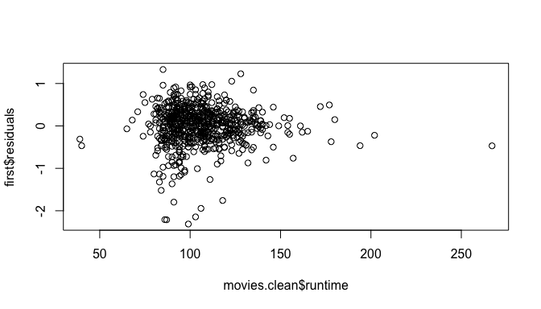<!-- -->

```r
# use a log transform on the imdb_num_votes to help spread out the data a bit
plot(first$residuals ~ log(movies.clean$imdb_num_votes))
```

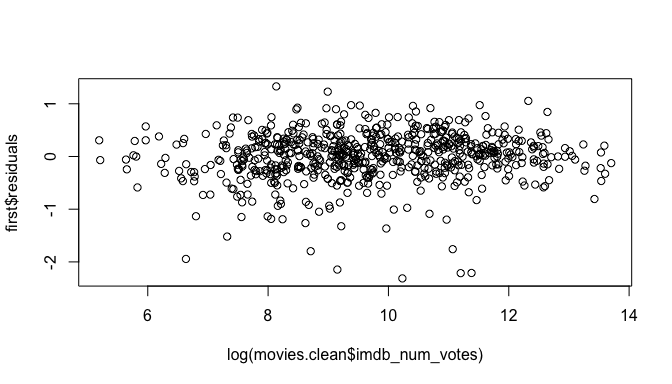<!-- -->

```r
plot(first$residuals ~ movies.clean$combined_score)
```

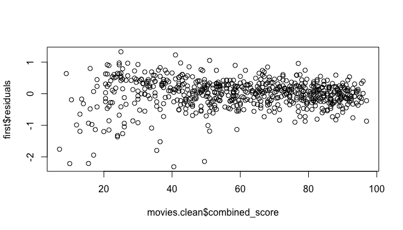<!-- -->

Based on the above plots, the explanatory variables show a random scatter about `0` and therefore exhibit a linear relationship with the response variable's (`imdb_rating`) residuals of the linear model.

#### 2. Checking for nearly normal residuals
Here I will use the base R plotting functions to plot a histogram and quantile-quantile plot of the model's residuals.


```r
# plot histogram
hist(first$residuals)
```

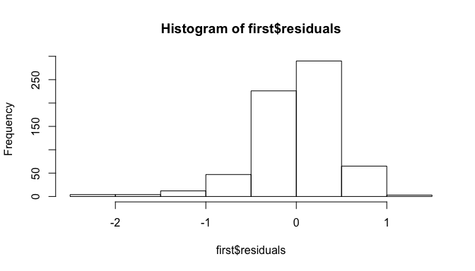<!-- -->

```r
# plot qqplot
qqnorm(first$residuals)
qqline(first$residuals)
```

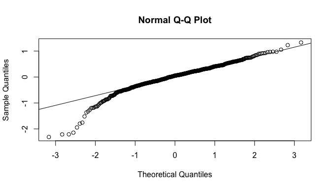<!-- -->

According to the plots above, there is some strong left-skew in the residuals. This is quite evident in both the histogram and the normal qqplot. While there are 651 observations in the `movies.clean` dataframe, which comprise a large sample size, predictions made from this model should be considered carefully on account of the strong left skew in the residuals.

#### 3. Checking for constant variability in residuals (homoscedasticity)
The residuals should be equally variable for low and high values of the predicted response variable (`imdb_rating`), which we can check by plotting the residuals versus the predicted values (e vs $\widehat{y}$). What we expect to see is the residuals are scattered in a constant band about `0` with no fan shape. If there is heteroscedasticity, we expect to see a fan shape in the plot and in case of the absolute value plot of residuals, a triangle shape.


```r
# plot predicted vs residuals
plot(first$residuals ~ first$fitted.values)
```

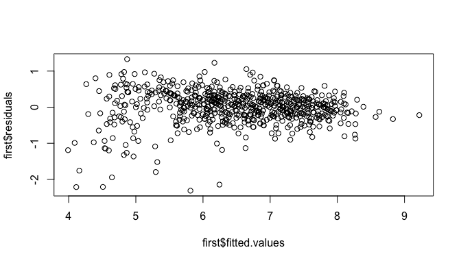<!-- -->

```r
# plot abs value of residuals
plot(abs(first$residuals) ~ first$fitted.values)
```

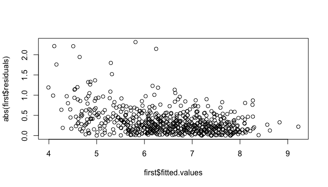<!-- -->

From the above plots, I would say that we have some slight non-constant variance in the residuals, especially for lower values of the fitted values. This fan shape is reminscient of the residuals plot for the `combined_score` variable above. Given these patterns, I would again be careful with the predictions made with this model. 

#### 4. Checking for independence of residuals
I do not expect there to be any underlying dependence among the movies as they were randomly sampled. However, we can check for any underlying time-series structure by plotting the residuals versus the order of data collection.


```r
# plot the residuals
plot(first$residuals)
```

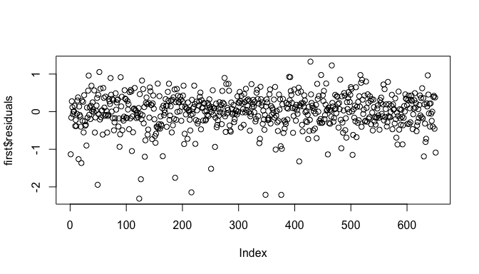<!-- -->

As suspected, the movies in the dataset are independent of one another and do not exhibit any underlying time-series structure. 

### Interpretation of model coefficients
As I have `16` coefficients in my linear model, it would be quite tiresome to interpret each and every one individually. For example, the `genre` variable has `10` levels. Therefore, for the sake of interpretation, I will write the linear equation for predicting the `imdb_rating` for an unknown documentary movie:

$$IMDBRating = 2.677 + 0.03795 * genreDocumentary  + 0.00299 * runtime + 0.000001238 * imdb\_num\_votes \\ + 0.01557 * critics\_ratingFresh + 0.07041 * critics\_ratingRotten + 0.00492 * combined\_score$$

##### Given the equation above, we can intepret the coefficients thusly:

1. Setting all variables to 0, the intercept `2.677` sets the height of the linear regression line. 
2. If the movie is a documentary, then we add `0.03795` to the intercept value.
3. For each minute of runtime, we expect the IMDB rating to increase by `0.00299` units. 
4. For each unit increase in votes, we expect the score to increase by `0.000001238` units.
5. If a critic's rating is "Fresh", then we add `0.01557` to the IMDB rating, otherwise if it is "Rotten", we only add `0.07041`. If the rating is "Certified Fresh", then nothing is added.
6. Lastly, for each unit increase in combined score, we expect the IMDB rating to increase by   `0.00492` units. 


* * *

## Part 5: Prediction


The movie I have chosen is one that I have seen recently and really enjoyed. It is called, [*The Man Who Knew Infinity*](https://www.youtube.com/watch?v=NP0lUqNAw3k) starring Dev Patel and Jeremy Irons. It is about a self-taught, brilliant Indian mathematician named Ramanujan and his friendship with his mentor, Professor G.H Hardy. I retrieved the movie data from its [Rotten Tomatoes](https://www.rottentomatoes.com/m/the_man_who_knew_infinity/) page. Its [IMDB](http://www.imdb.com/title/tt0787524/?ref_=fn_al_tt_1) rating as of March 20, 2017 is `7.2`. 


```r
# check to make sure my movie choice does not exist in the dataframe
grep("Infinity", movies.clean$title, ignore.case = TRUE)
```

```
## integer(0)
```

```r
# all ok, my movie is not in the movies.data; create the new dataframe that I'll use for predictions 
the.man.who.knew.infinity.2016 <- data.frame(genre = "Art House & International", runtime = 108,
                                             imdb_num_votes = 27398, critics_rating = "Fresh",
                                             combined_score = mean(c(61,72)))

# run the prediction and include the prediction interval in the output
predict(first, the.man.who.knew.infinity.2016, interval = "predict")
```

```
##        fit      lwr      upr
## 1 6.841057 5.884968 7.797145
```

#### Interpretation of prediction
Based on the linear model that I have constructed, we have obtained a predicted IMDB rating of `6.84` that falls within a 95% confidence interval of `(5.88, 7.80)`. Therefore, we are 95% confident that the true IMDB rating of *The Man Who Knew Infinity* is between `5.88` and `7.80`. 

Given that we know the actual value is indeed `7.2`, I'd venture to say that our model did a pretty good job of predicting the rating.  

* * *

## Part 6: Conclusion

As a reminder, the research question that I proposed at the beginning of this project was the following: 

##### What factors are associated with movie popularity and can we use these factors to predict if a movie is popular?

I chose to define movie popularity by a movie's IMDB rating. The higher the IMDB rating, the more "popular" the movie. Based on this definition, I created a linear model to predict a movie's IMDB rating that used features such as the runtime of the movie, a combined score of critics and audience scores from Rotten Tomatoes and the number of votes at IMDB per movie, to name a few. The model I created yielded an adjusted ${R}^2$ of `0.8128`, meaning that roughly 81% of the variability in a movie's "popularity" (i.e. IMDB rating) can be explained by the chosen features within my linear model. 

While the model I generated predicted a 95% confidence interval that actually contained the true IMDB rating for the movie I selected, the model had at least one red flag: there is some non-constant variance and strong left skew in the residuals (see Model diagnostics above) for lowly rated movies, which could affect the validity of the model.

Another shortcoming of my approach was that I simply ignored all variables related to release dates. It could be rather important to consider how the timing of a movie's release may impact its popularity. Another glaring weakness of my approach is to equate popularity with IMDB rating, as there could be many movies that are popular, but rated poorly. Lastly, using a p-value based approach for model selection may have yielded an inferior model in terms of predicitive power. 

Future work could include the exploration of more features/variables to increase the accuracy of the model's predictions, in addition to exploring alternative model selection strategies. We could also take a larger sample size of movies that would presumably help in increasing predicitive power and accuracy.

